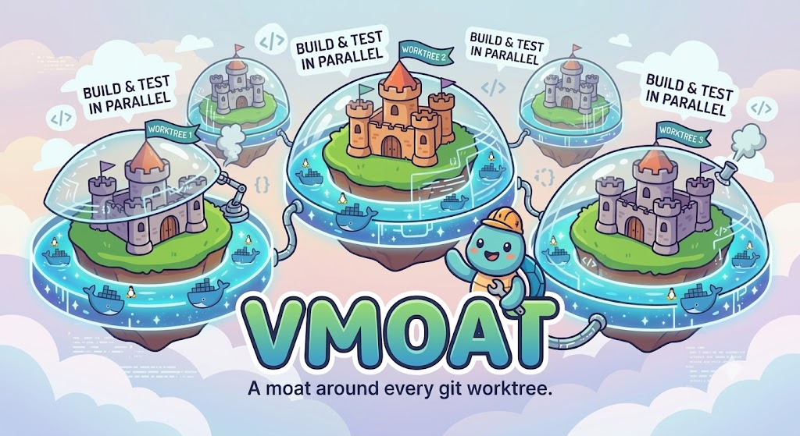
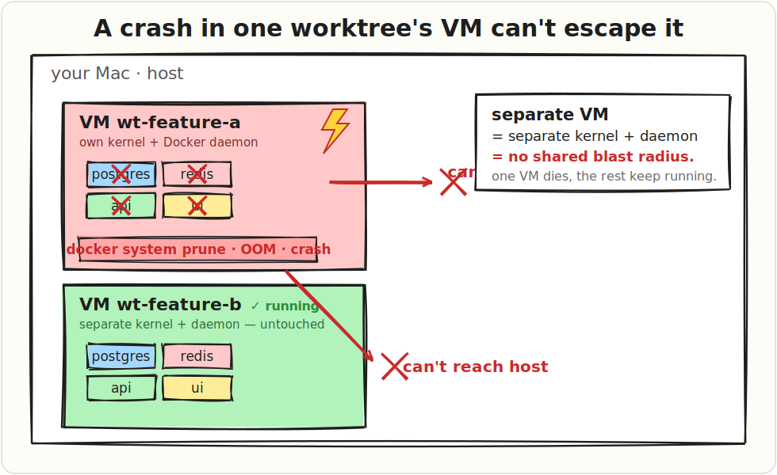
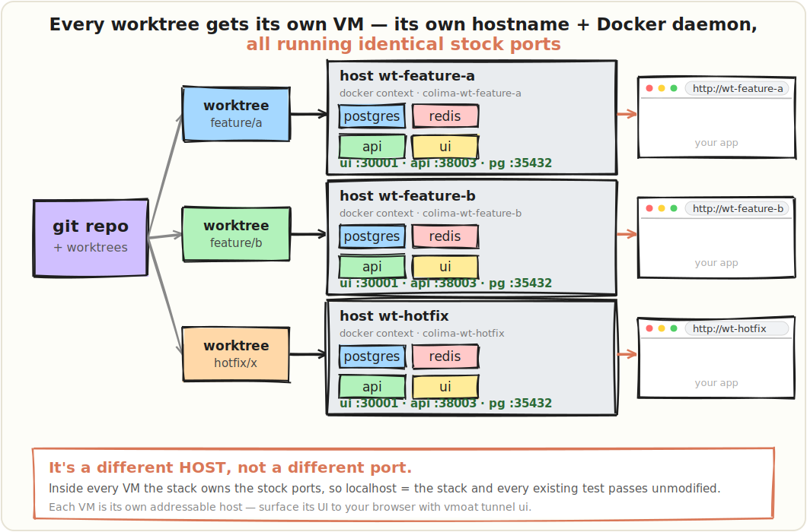
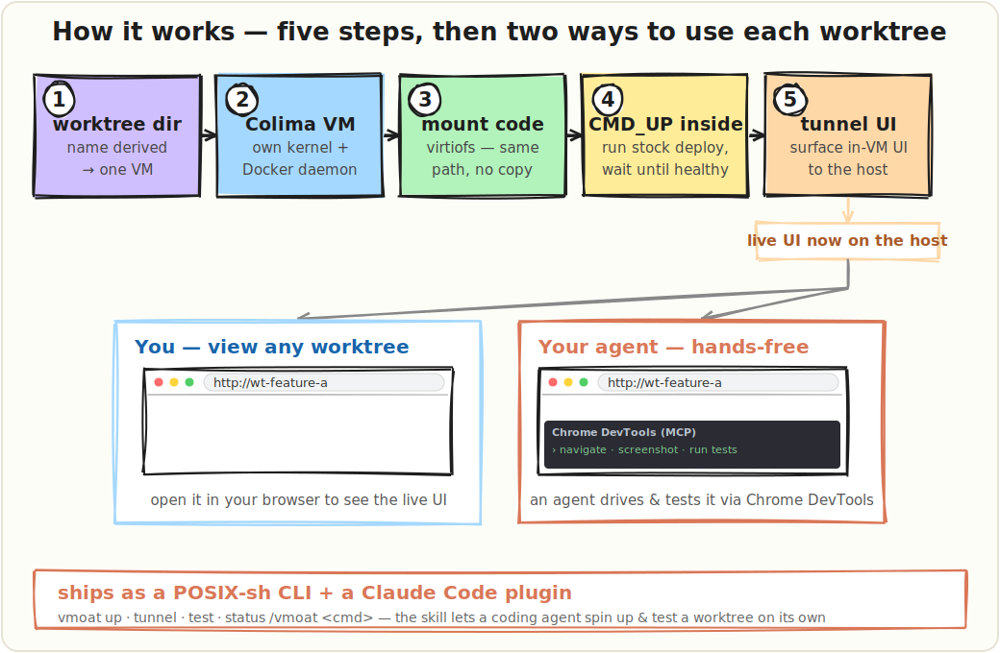

# vmoat
<p align="center">
  
</p> 
**A moat around every git worktree.** One ephemeral [Colima](https://github.com/abiosoft/colima) VM per worktree, so you can build and test multiple worktrees of the same project **in parallel** — each sealed in its own Linux kernel + Docker daemon.

[](https://code.claude.com/docs/en/plugins)
[](./bin/vmoat)
[](#requirements)
[](https://github.com/abiosoft/colima)
[](./LICENSE)
[](./.claude-plugin/plugin.json)

A `docker system prune`, an OOM, or a crashed stack in one worktree can **never** touch another worktree or your host. 

The VM *is* the moat: inside it you run your project's **stock** commands (`./deploy.sh local`, `make up`, `docker compose up` …) with all defaults — no port-juggling, and **every existing test passes unmodified**, because inside the box `localhost` *is* the stack.

<p align="center">
  
</p>

Ships as **both a POSIX-sh CLI and a Claude Code plugin** (a skill + a `/vmoat` command), so a coding agent can spin up and test a worktree in isolation on its own. It is **project-agnostic**: everything specific to a repo lives in a small `vmoat.conf`.

---

## Why a VM per worktree, not namespaced stacks on one daemon?

Running N stacks on a single Docker daemon with different project names/ports works — until one worktree runs `docker system prune`, `down --volumes`, or blows up RAM/disk, and **every** stack dies with it. Separate VMs = separate daemons = **no shared blast radius**.

The bonus is that each VM is a *separate host*, not a separate port. Inside every VM the stack owns the **default** ports, so `localhost:38003` *is* the stack and your tests need zero changes.

<p align="center">
  
</p>

Each worktree gets its **own** VM automatically (the name is derived from the worktree directory — see `vmoat name`). Run `up` in two worktrees and you have two fully isolated stacks at once, each addressable as its own host.

## How it works

<p align="center">
  
</p>

- **Worktree → VM:** the name is derived from the worktree dir; one `colima -p <name>` profile each, with its own Docker context (`colima-<name>`).
- **Code into the VM:** Colima mounts `VM_MOUNT` writable at the same path, so the worktree is visible inside the VM unchanged — no copy/sync.
- **Deploy + test:** run inside the VM via `colima ssh`; `localhost` ports resolve to the stack, so stock commands and tests Just Work.
- **Two ways to use it once it's up:**
  - **You:** `vmoat tunnel` opens SSH port-forwards to the in-VM ports — point your browser there to see the live stack.
  - **Your agent:** the Claude Code plugin lets a coding agent bring a worktree up, run its tests, and drive the tunnelled UI through **Chrome DevTools (MCP)** — hands-free, in isolation, in parallel with your other worktrees.

## Requirements

- **macOS** (Apple Silicon recommended — fast `vz` + `virtiofs` backend), **Linux**, or **Windows + WSL2** (Colima runs on `qemu` + KVM there).
- [`colima`](https://github.com/abiosoft/colima) and a `docker` CLI.
- Enough RAM for the stacks you run concurrently (a heavy stack ≈ several GB each).

The VM backend is **auto-detected** (macOS → `vz`+`virtiofs`; Linux/WSL2 → Colima's native `qemu`+KVM). Override per project via `VM_TYPE` / `MOUNT_TYPE`.

## Install

### Install Colima (one-time)

- **macOS / Linux:** `brew install colima docker`
- **Windows (WSL2):** install Colima **inside** your WSL2 distro (Homebrew-on-Linux or your distro's package), and enable nested virtualization in `%UserProfile%\.wslconfig`:
  ```ini
  [wsl2]
  nestedVirtualization=true
  ```
  Run `vmoat` inside the distro, with your worktrees on the Linux filesystem (`~/...`, **not** `/mnt/c` — far faster).

### As a CLI

```sh
git clone https://github.com/voycey/vmoat ~/.vmoat
ln -s ~/.vmoat/bin/vmoat /usr/local/bin/vmoat   # or ~/.local/bin
```

### As a Claude Code plugin

```text
/plugin marketplace add voycey/vmoat
/plugin install vmoat@vmoat
```

…or, for a quick test without installing: `claude --plugin-dir ~/.vmoat`. Once enabled, the plugin's `bin/` is on `$PATH` automatically, the skill is model-invoked when you ask Claude to build/test a worktree in isolation, and `/vmoat <cmd>` is available as a slash command.

## Quickstart

From any worktree of a project that has a `vmoat.conf`:

```sh
vmoat up            # create VM, install toolchain, run CMD_UP, wait until healthy
vmoat tunnel        # forward every EXPOSE_PORTS to the host (prints each URL)
vmoat test --quick  # run CMD_TEST --quick INSIDE the VM (localhost = the stack)
vmoat status        # VM status, containers, health, open tunnels
vmoat down          # stop the VM (keeps disk)
vmoat destroy       # delete the VM entirely
```

Each worktree gets its **own** VM automatically (name derived from the worktree dir — see `vmoat name`). Run `up` in two worktrees and you have two fully isolated stacks at once.

## Configure

Copy [`vmoat.example.conf`](./vmoat.example.conf) to your repo root as `vmoat.conf`. It is shell-sourced (`KEY="value"`) and trusted project code. **The only required setting is `CMD_UP`** — everything else is optional, so vmoat stays general-purpose (no assumptions about your stack, secrets tooling, or health endpoints).

| Key | Req | Meaning |
|---|---|---|
| `CMD_UP` | **yes** | command run **inside** the VM to bring the stack up (e.g. `docker compose up -d`) |
| `CMD_TEST` | no | command run inside the VM for `vmoat test` (args appended) |
| `VM_CPU` / `VM_MEMORY` / `VM_DISK` | no | VM sizing (RAM is the real ceiling on parallelism) |
| `VM_MOUNT` | no | host path mounted **writable** into the VM (must contain the worktree); default `$HOME` |
| `PROVISION_APT` | no | extra apt packages the base VM lacks |
| `PROVISION_SCRIPT` | no | arbitrary shell to install anything apt can't (e.g. dotenvx — only if you use it) |
| `PROVISION_SEED` | no | gitignored files copied from the main checkout into a fresh worktree |
| `HEALTH_URL` / `HEALTH_TIMEOUT` | no | if set, `up` waits until this URL returns 2xx inside the VM |
| `EXPOSE_PORTS` | no | guest ports (bash array or space-separated string) `tunnel` surfaces to the host |
| `VM_TYPE` / `MOUNT_TYPE` | no | force a Colima backend (otherwise auto-detected per platform) |

### Per-worktree overrides — `vmoat.local.conf`

`vmoat.conf` is committed, so it's shared by every worktree on that branch. When **one** worktree needs different settings — most often a different `EXPOSE_PORTS` because it runs different code — drop a **`vmoat.local.conf`** in that worktree's directory. It's **gitignored**, so it exists only in that worktree, and it's sourced **after** `vmoat.conf`, so it wins:

```sh
# .../worktrees/feature-x/vmoat.local.conf  (gitignored — only this worktree)
EXPOSE_PORTS=(30001 38003 9229)   # this branch adds a debug port
VM_MEMORY=24                      # …and needs more RAM
```

Add `vmoat.local.conf` to your repo's `.gitignore`. Any key (ports, sizing, commands, health) can be overridden per worktree this way — shared defaults in `vmoat.conf`, per-worktree deltas in `vmoat.local.conf`.

<details>
<summary>Example: a RAG stack driven by <code>./deploy.sh</code></summary>

```sh
VM_CPU=6; VM_MEMORY=16; VM_DISK=80
VM_MOUNT="$HOME/github"
PROVISION_APT="git jq curl ca-certificates"
PROVISION_SCRIPT='command -v dotenvx >/dev/null 2>&1 || curl -sfS https://dotenvx.sh | sudo sh'
PROVISION_SEED=".env.keys"
CMD_UP="INSTANCE_NAME=local VERSION=local ./deploy.sh local"
CMD_TEST="INSTANCE_NAME=local VERSION=local ./deploy.sh test"
HEALTH_URL="http://127.0.0.1:38003/health"
EXPOSE_PORTS=(30001 38003)
```
</details>

## Commands

| Command | Does |
|---|---|
| `provision` | Create/start the worktree's VM, install the toolchain, seed files |
| `up` | `provision` + run `CMD_UP` inside the VM (+ wait for `HEALTH_URL` if set) |
| `test [args]` | Run `CMD_TEST [args]` inside the VM |
| `tunnel [port…]` | SSH-forward in-VM port(s) to free host ports (default: every `EXPOSE_PORTS`) |
| `untunnel` | Close all tunnels for this worktree's VM |
| `status` | VM status, containers, health, open tunnels |
| `ssh [cmd]` | Shell into the VM (or run a command in the worktree dir) |
| `down` / `destroy [-f]` | Stop (keep disk) / delete the VM |
| `name` | Print the VM/profile name for this worktree |

## Caveats

- **First `up` per VM is slow** (~10–20 min) — it builds the project's images with no cache shared between VMs. Subsequent runs reuse them.
- **Disk:** images are duplicated per VM. Budget `VM_DISK` accordingly.
- **RAM is the ceiling** on how many run at once.
- **Backend differs by platform:** macOS gets `vz`+`virtiofs` (fast); Linux/WSL2 use `qemu`+KVM. On WSL2, nested virtualization must be enabled or `colima start` can't boot the VM.
- Some stacks abort the *very first* `up` on a fresh DB volume (a `depends_on: service_healthy` catching `initdb` mid-restart) — just re-run `up`.

## Publishing your own plugin

This repo is itself a Claude Code marketplace (`.claude-plugin/marketplace.json`). To distribute a plugin like it:

1. Validate: `claude plugin validate .`
2. Push to GitHub. Users add + install with:
   ```text
   /plugin marketplace add <owner>/<repo>
   /plugin install <plugin>@<marketplace-name>
   ```
3. For broad discovery, open a PR to the officially-endorsed community marketplace [`anthropics/claude-plugins-community`](https://github.com/anthropics/claude-plugins-community) (auto-validated); users then `/plugin install <plugin>@claude-community`.

Versioning: bump `version` in `plugin.json` and git-tag releases for pinned updates, or omit `version` to roll updates on every commit (git SHA).

## License

[MIT](./LICENSE) © Dan Voyce
